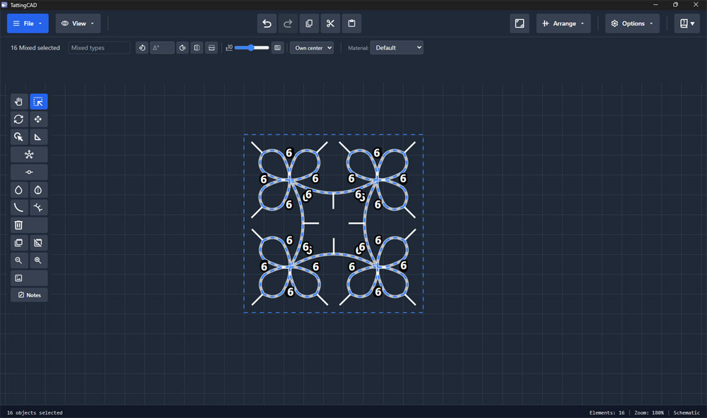

# TattingCAD

A pattern design tool for needle and shuttle tatters.  
Built because nothing like it existed.

> **Tatting** is a form of lace-making worked with a shuttle or needle, building rings and chains from a series of knots. TattingCAD lets you design, annotate, and export tatting patterns on a digital canvas.



**Current version:** 1.0.0 &nbsp;|&nbsp; Windows · Linux · macOS · Android &nbsp;|&nbsp; Free, forever

---

## Get it

| Platform | Notes |
|---|---|
| Windows | Installer — ready to run |
| Ubuntu | `.deb` and `.AppImage` |
| macOS | Unsigned — allow it manually in **System Settings → Privacy & Security** |
| Android | Unsigned APK — enable **Install from unknown sources** in your settings |

No account. No cloud. No trackers. Everything stays on your device.

⚠️ Installation Notes:

TattingCAD is an independent release and the installers are currently unsigned. 
This means your OS may show a security warning — this is expected and safe to dismiss.

Windows: When prompted by SmartScreen, click More info → Run anyway.

macOS: Apple blocks unsigned apps by default. To open TattingCAD:

Download the .dmg and drag TattingCAD to your Applications folder
Try to open it — you'll get a warning that it can't be opened
Go to System Settings → Privacy & Security
Scroll down and you'll see a message about TattingCAD being blocked — click Open Anyway
Confirm in the dialog that appears
You only need to do this once.

Android: Enable Install from unknown sources in your device settings, then open the .apk file to install.

---

## Features

- Draw rings, chains, picots
- Use Thread Properties to create aproximate measurements, and aproximate the materials needed
- Tatting Order mode — number elements across named rounds
- Generates written notation from your diagram
- Realistic and schematic rendering modes
- Beads - both with BE element or inline notation
- Polar grids
- Linear, Polar and Spiral Arrays
- Full material library (DMC thread colors + gradients)
- SVG export

---

## Localization

Currently available in **English** and **Hungarian**.  
A **Spanish** translation exists but is AI-generated and has not been reviewed by a native speaker.

The app is fully ready to be translated into any language — all UI strings are in a single JSON file.

- `INFO_LOCALIZATION.md` — how the translation system works
- `INFO_translation-reference.md` — craft terminology reference (EN / HU / ES, with Japanese notes)
- `TOOL_translator_helper.html` — browser-based tool for manual translation or updating existing keys

If you're a native speaker of any language and want to contribute a translation, that would be very welcome.

---

## For the programmers

This was built with AI assistance over 30 sessions. I'm a former game designer and crafter, not a developer. I treated the AI the way I'd treat a programmer on a project — design in, spec out, iterate.

The code is what it is. I'd genuinely love to know what you think.

**To build from source:**

```bash
# Requirements: Node 24+, Rust stable
npm install
npm run tauri build
```

Built with [Tauri v2](https://tauri.app/) + React + TypeScript.

**Bug reports and feedback:** open a [GitHub Issue](../../issues) — or if it's more of a thought than a bug, [contact me](https://savarosacraft.com/contact/) through my website.

---

## Support

If it's been useful, you can tip me on Ko-fi.  
No pressure. It's free and will stay free.

[ko-fi.com/savarosacraft](https://ko-fi.com/savarosacraft)

---

*Made by SavarosaCraft*
